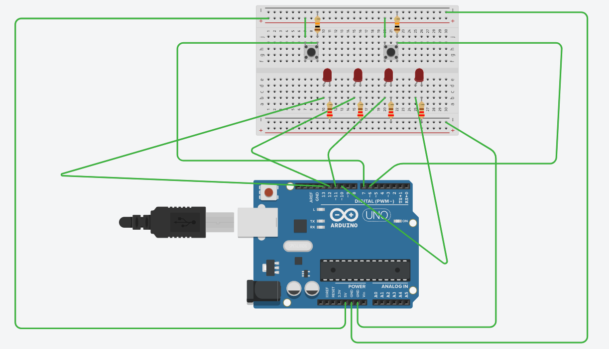
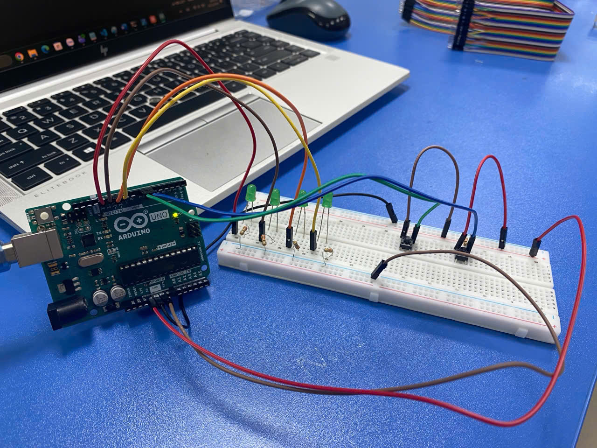
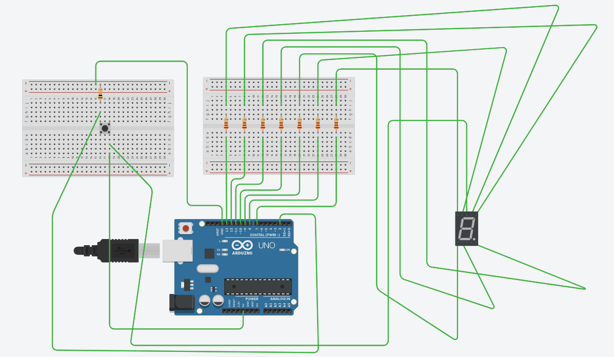
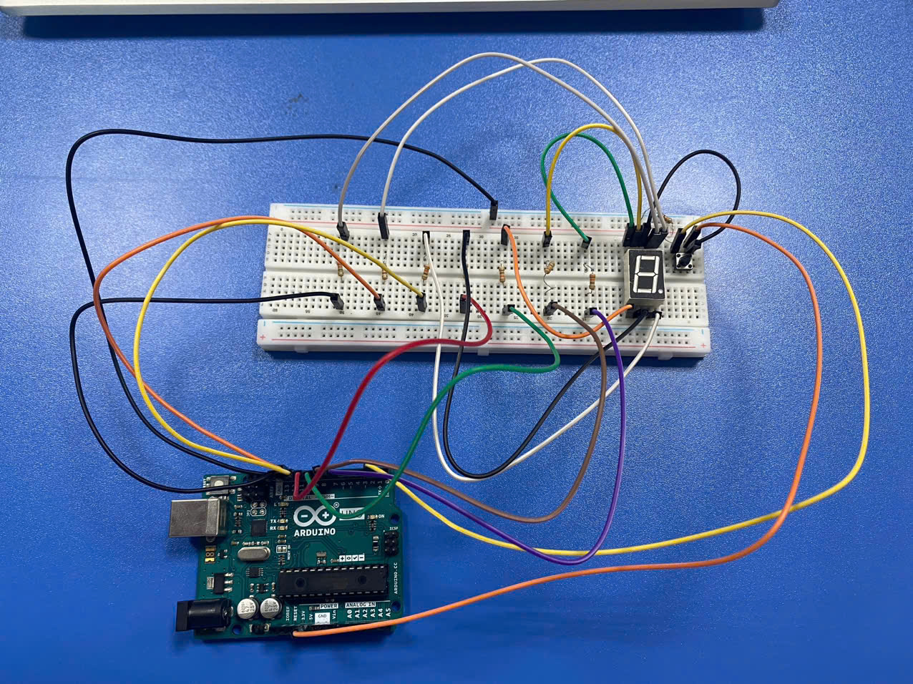

# Lab 1 — Giới thiệu về Arduino

> README hiện tại chỉ gồm nội dung thực hiện bài 1 và bài 4 (phần việc mình được giao trong phần làm nhóm). Các bài còn lại sẽ được bổ sung sau khi mình tự thực hành.

## Mục tiêu lab
Trong bài lab này, mình đã tìm hiểu về:
- Các khái niệm cơ bản trong lập trình nhúng,
- Nền tảng cơ bản về Arduino, bao gồm mạch phát triển, framework, môi trường/công cụ sử dụng, phong cách lập trình để tạo ra những ứng dụng IoT đơn giản đầu tiên,
- Cách kết hợp bo mạch Arduino với một số linh kiện điện tử cơ bản như đèn LED, điện trở, breadboard, nút bấm,... để thực hiện thêm nhiều kịch bản ứng dụng IoT khác.

## Môi trường & Linh kiện
**Môi trường**
- Arduino IDE 2.3.10

**Linh kiện**
- Arduino Uno R3  
- LED 7 đoạn (loại Anode chung)
- LED màu
- Nút bấm
- Điện trở
- Dây jumper
- Breadboard

---

## Bài 1: Bộ đếm nhị phân 4 bit

### Đề bài
Xây dựng một mạch đếm số nhị phân 4 bit dùng 4 đèn LED và 2 nút bấm mà trong đó, trạng thái sáng/tắt của từng đèn sẽ đại diện cho giá trị 1/0 của từng bit. Một nút bấm có tác dụng tăng giá trị đếm thêm một đơn vị theo chiều đếm hiện tại, và nút bấm còn lại có tác dụng đảo chiều đếm đó. Khi đếm đến giá trị vượt quá 15 thì cho giá trị đếm quay về 0. Ngoài ra, cũng in log ra Serial Monitor mỗi khi giá trị thay đổi.

### Linh kiện
- 1 Arduino Uno R3
- 4 LED đỏ
- 2 nút bấm
- 4 điện trở 220 Ohm
- 2 điện trở 10k Ohm
- 1 breadboard
- 11 dây jumper

### Mạch
Mạch điện mô phỏng:

Mạch điện thực tế:

### Code
[Source code](exercise_1/exercise_1.ino)

### Khó khăn và cách giải quyết
| Hiện tượng | Nguyên nhân | Cách phát hiện | Cách xử lý |
|----------|----------|----------|---|
| Cắm mạch vật lý thấy value và LED nhảy loạn xạ. Lúc không nhấn nút thì chuyển trạng thái, lúc nhấn nút thì không phản ứng gì, logic nút counter và direction lẫn lộn nhau. | Chưa nối phía còn lại của 2 nút bấm xuống GND (qua điện trở). Chân digital không có đường về GND nên lúc chưa nhấn nút bị "floating", đọc tín hiệu loạn. | Kiểm tra lại đường đi dây của mạch điện thực tế, đối chiếu kỹ càng với mạch điện mô phỏng. | Nối lại các đường dây còn thiếu. |

---

## Bài 4: Mã số sinh viên của nhóm là gì?

### Đề bài
Xây dựng một kịch bản sao cho LED 7 đoạn có thể hiển thị lần lượt từng chữ số trong mã số sinh viên của các thành viên nhóm trong một khoảng thời gian. Tại mỗi thời điểm, chỉ có một MSSV được hiển thị lặp đi lặp lại, ngăn cách bởi một dấu gạch ngang khi kết thúc mã số. Khi người dùng nhấn nút, mạch lập tức chuyển sang hiển thị mã số của sinh viên kế tiếp, đồng thời in log ra Serial Monitor. Lưu ý quan trọng:
- Giữa 2 ký tự liên tiếp được hiển thị (chữ số, dấu gạch ngang) phải có một khoảng nghỉ ngắn,
- Khi người dùng nhấn nút, mạch phải cho hiển thị mã số sinh viên mới ngay, không được có độ trễ.

### Linh kiện
- 1 Arduino Uno R3  
- 1 LED 7 đoạn (loại Anode chung)
- 1 nút bấm
- 7 điện trở 220 Ohm
- 1 điện trở 10k Ohm
- 18 dây jumper
- 2 breadboard

### Mạch
Mạch điện mô phỏng:

Mạch điện thực tế:

### Code
[Source code](exercise_4/exercise_4.ino)

### Khó khăn và cách giải quyết
| Hiện tượng | Nguyên nhân | Cách phát hiện | Cách xử lý |
|-------|-------|-------|---|
| Cắm chân chung của LED 7 đoạn vào chân GND Arduino và chập chân nguồn của Arduino vào từng chân điều khiển các đoạn LED thì không có đoạn nào sáng. | LED 7 đoạn mượn từ lab là loại Anode chung, không phải Cathode chung như loại đã dùng để mô phỏng trước đó. | Tìm thông tin về cách hoạt động của linh kiện LED 7 đoạn. | Sửa code lại để khớp logic: muốn bật đèn thì xuất điện áp thấp - muốn tắt đèn thì xuất điện áp cao. |
| Nạp code vào mạch điện thực tế thấy các đoạn LED không sáng như kì vọng - nhấn nút không hiển thị mã số nào. | Chưa nối dây nguồn chung vào nguồn 5V của Arduino. | Nhìn hành vi của LED 7 đoạn trong mạch thực tế. | Nối dây nguồn chung còn thiếu. |

---

## Mình đã học được gì?
- Tranh thủ thời gian mô phỏng hoạt động của mạch ở nhà bằng phần mềm trước khi lên lab mượn thiết bị để cắm mạch thực tế.
- Tập thói quen sử dụng hàm `millis()` và một biến ghi lại mốc thời gian để tính giờ kích hoạt sự kiện, thay vì dùng `delay()` - một blocking function.
- Khi làm việc với nút bấm thì rất nên có logic chống nhiễu:
  - Nhiễu nút bấm là hiện tượng: Vì đặc tính cơ học, khi ta nhấn nút thật, hai lá kim loại bên trong nút chạm nhau rồi nảy lên nảy xuống liên tục trong vài mili giây trước khi ổn định. Và Arduino đọc được tín hiệu này thì lại "nghĩ" là người dùng nhấn nút nhiều lần liên tục.
  - Chống nhiễu là việc ta đợi khoảng vài chục ms cho tín hiệu tại nút bấm ổn định rồi mới xử lý.
- Tư duy lập trình kiểu máy trạng thái (state machine) *(dù mình không chủ động nhận ra điều đó khi thiết kế chương trình)*.
- Tự cắm mạch đơn giản để kiểm tra LED 7 đoạn là loại Anode chung hay Cathode chung trước khi dùng, tránh mất thời gian debug oan khi mạch không hoạt động như ý sau đó.